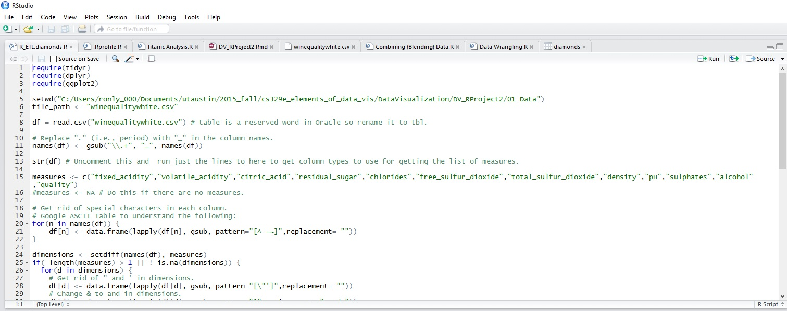
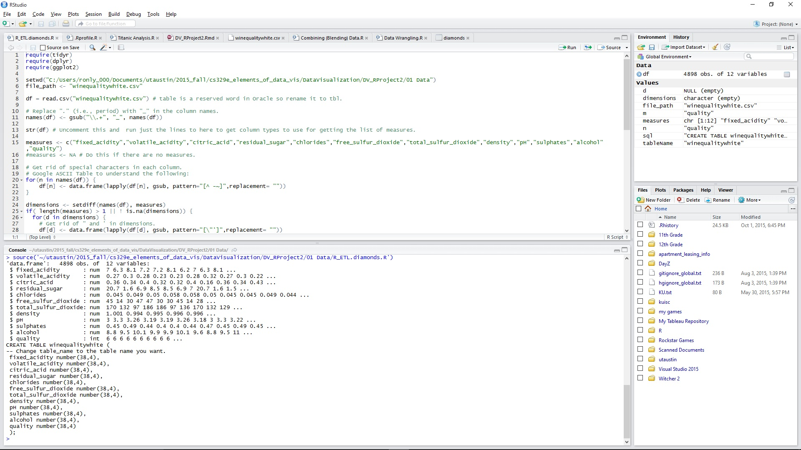
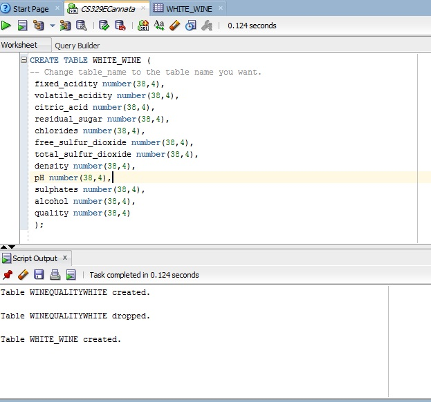
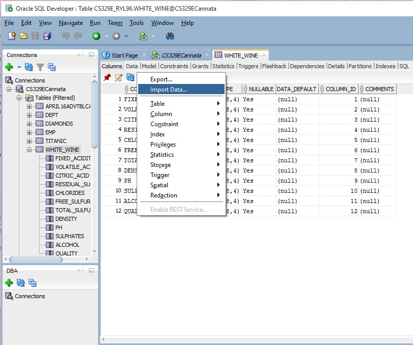
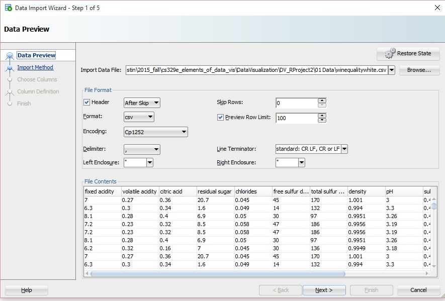
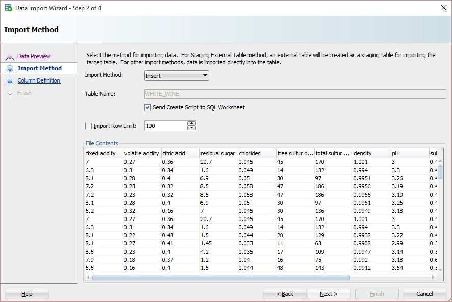
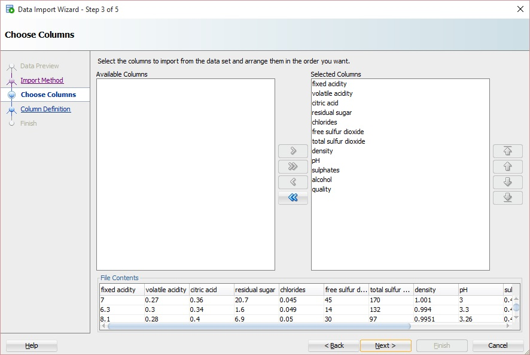
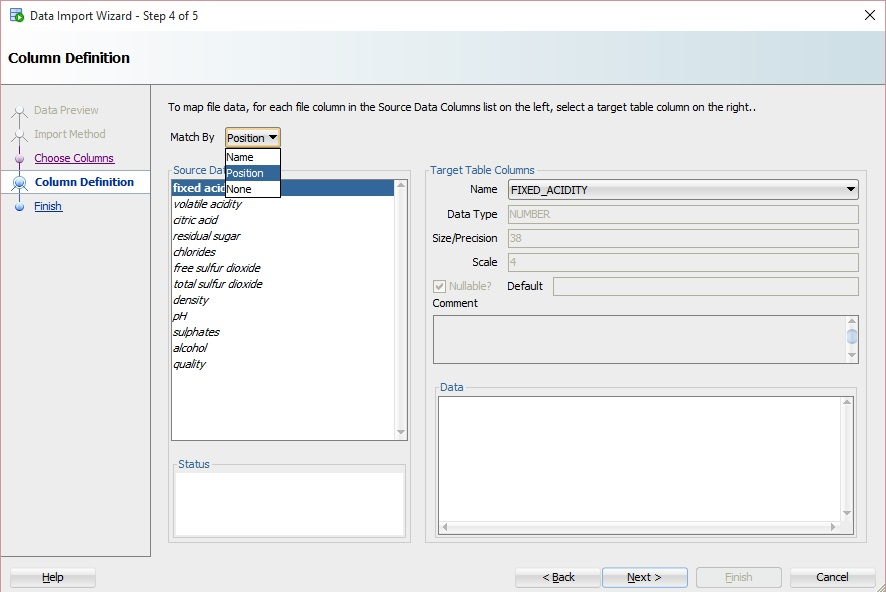
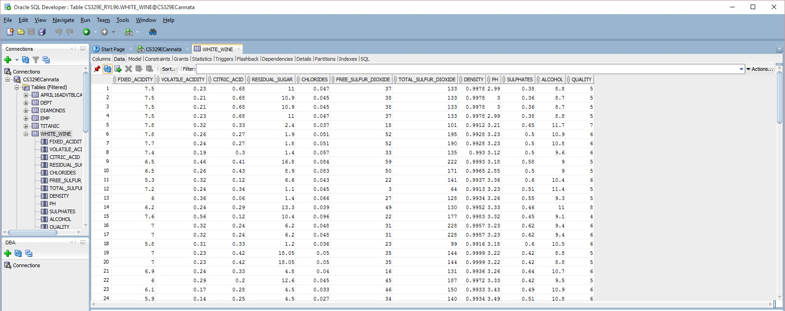

```{r message = FALSE}
require("jsonlite")
require("RCurl")
require(extrafont)
require(ggplot2)
```

## Procedure for getting our csv data onto Oracle.

#### 1. Require packages.


#### 2. Modify R_ETL.R: set working directory and file path, read our csv, use str() to determine which variables are continuous, and change measures accordingly. 



#### 3. Run the code to get the SQL CREATE TABLE command. 
#### 4. Use the command to create a table in SQL Developer to create a new table. 




#### 5. Open the table, click "Actions," and "Import Data..." 



#### 6. Follow through the data import wizard (Match by Position)






#### 7. All data from the csv file data should now be entered into the SQL table you created.




### Data Frame 1 (White Wine Only)
```{r}
source("../01 Data/white.R", echo = TRUE)
```

### Data Frame 2 (Red and White Wine)
```{r}
source("../01 Data/redwhite.R", echo = TRUE)
```

df %>% filter(DENSITY <= 1.01) %>% ggplot(aes(x=ALCOHOL, y=DENSITY, color=QUALITY)) + geom_point() + scale_colour_gradientn(colours = rainbow(7))

df %>% select (QUALITY, CITRIC_ACID, COLOR) %>% filter(CITRIC_ACID <= 1.2) %>% group_by(QUALITY, CITRIC_ACID) %>% ggplot (aes (x=QUALITY, y=CITRIC_ACID)) +geom_boxplot(aes(color=factor(QUALITY)),fill=NA) + scale_x_continuous(breaks = c(3,4,5,6,7,8,9)) + geom_point (aes(color = factor(QUALITY))) + geom_jitter(alpha = .15, aes(color=factor(QUALITY))) + facet_wrap(~COLOR)


df %>% filter (TOTAL_SULFUR_DIOXIDE < 150, RESIDUAL_SUGAR < 20, CHLORIDES<.2) %>% ggplot(aes(x=TOTAL_SULFUR_DIOXIDE, y=RESIDUAL_SUGAR, color=CHLORIDES)) + geom_point() + scale_colour_gradientn(colours = rainbow(7)) + facet_wrap(~COLOR)


Wine experts tasted and rated the quality of each wine sample on a scale from 0 (very bad) to 10 (very excellent). 

Citation:  
P. Cortez, A. Cerdeira, F. Almeida, T. Matos and J. Reis. 
Modeling wine preferences by data mining from physicochemical properties.
In Decision Support Systems, Elsevier, 47(4):547-553. ISSN: 0167-9236.
